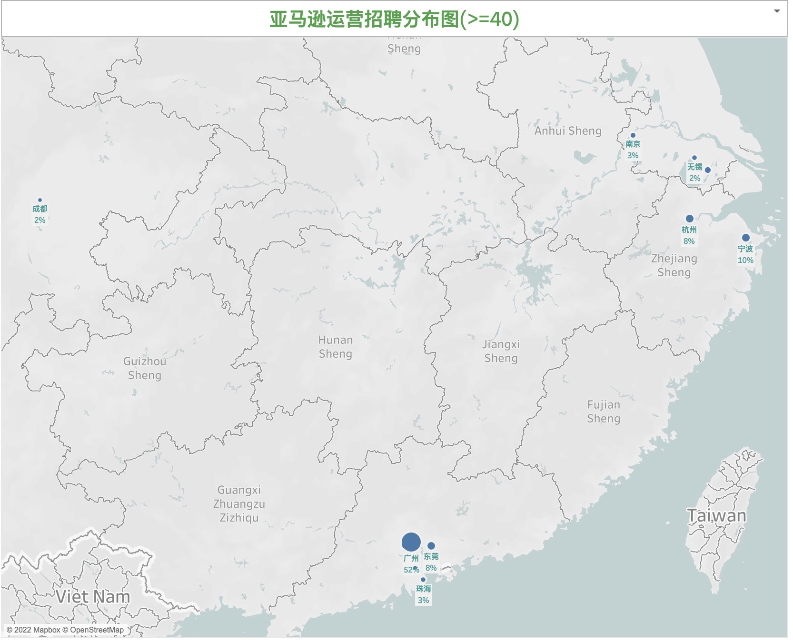
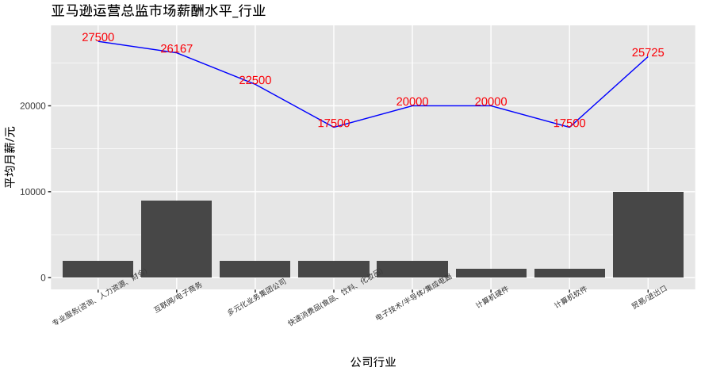
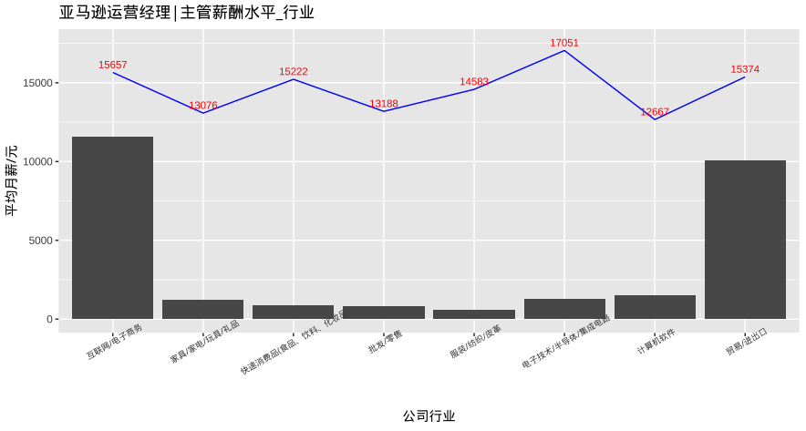
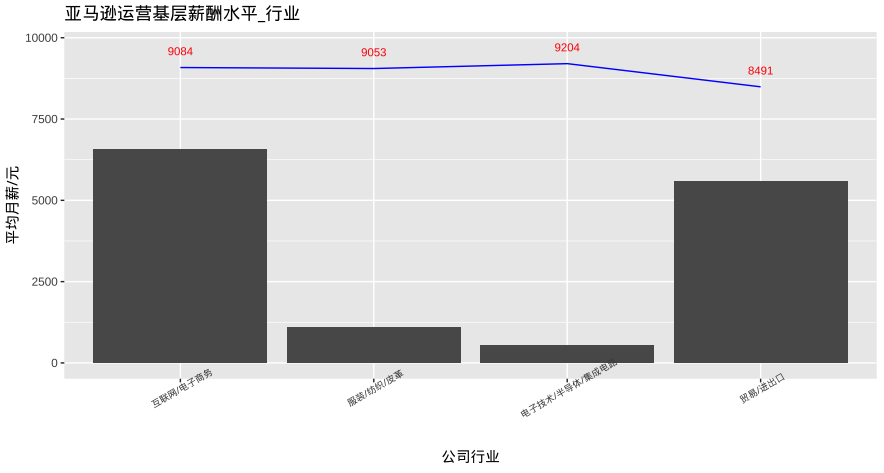
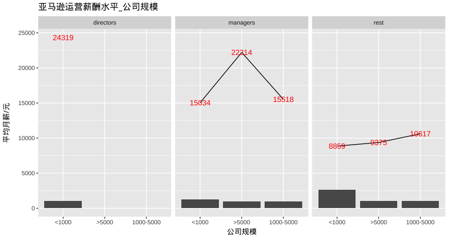
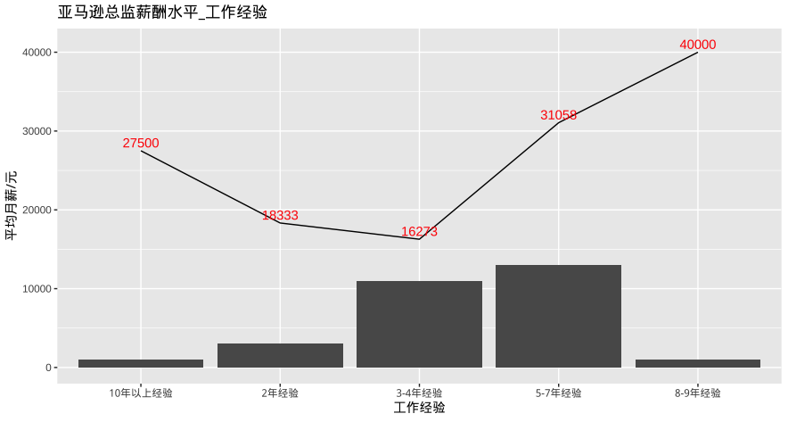
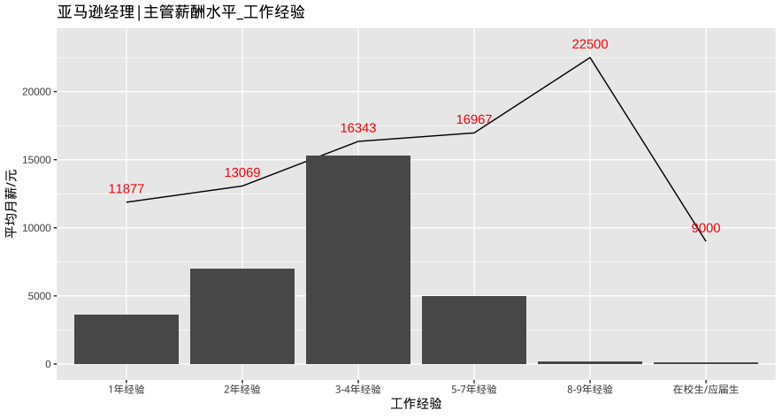
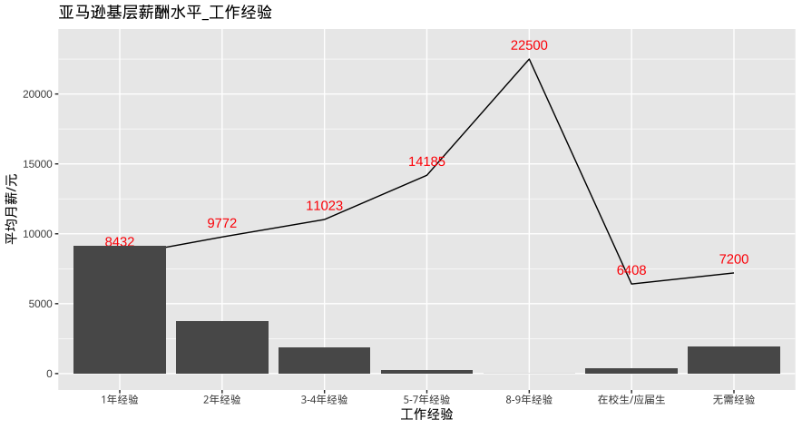
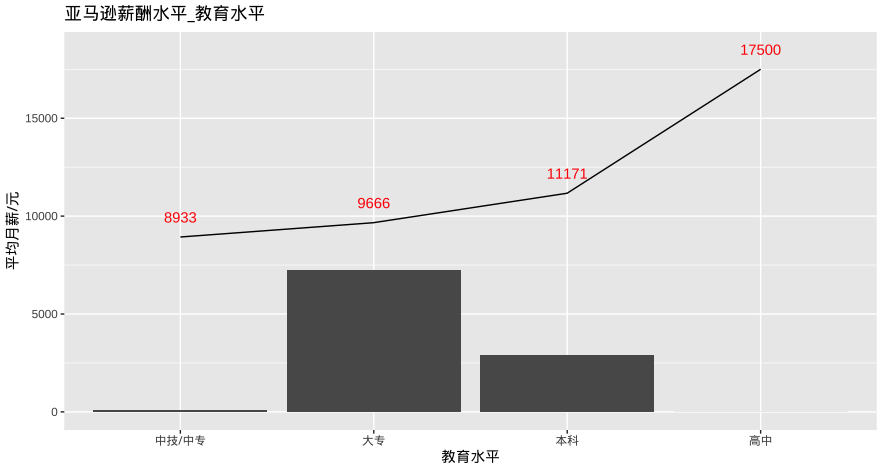
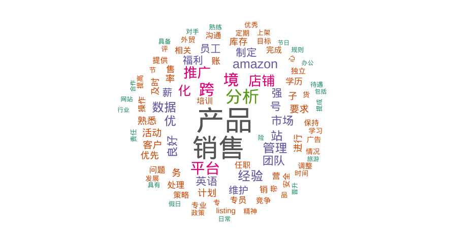

# 亚马逊运营招聘市场分析

## 总述

本次采集有效数据2328条，按城市岗位发布量\>=40,形成数据2071条，主要分析招聘和薪酬水平，我们将从如下方面分析：

-   城市分布：招聘主要来自广州，占市场招聘的52%，平均月薪10275元；宁波占10%，平均月薪10105元；东莞和杭州均占8%，东莞平均月薪9296元，杭州平均月薪10494元；其余都在5%以下。

-   公司行业：互联网/电商占38%，平均月薪10254元；贸易/进出口占32%，平均月薪9788元；服装/纺织/皮革占6%，平均月薪9337元；其余行业都在4%以下。

-   公司规模：1000人以下占96%，平均月薪10K元；1000-5000人占3%，平均月薪11434元；5000人以上占1%，平均月薪13655元。

-   公司类型：90%的招聘来自民企，平均月薪10030元；合资占2%,平均月薪11066元；外资占4%,平均月薪10481元。

-   工作经验：1年经验占46%，平均月薪8563元；2年经验占22%，平均月薪10345元；3-4年经验占17%，平均月薪13492元；总之，85%的招聘要求平均经验2.5年。

-   学历要求：大专占70%，平均月薪9666元；本科占28%，平均月薪11171元。

-   工作简述：

    -   亚马逊总监主要工作：跨境营销，管理团队和销售目标,制定营销策略，数据分析、熟悉市场/竞对信息/平台规则、英语。
    -   亚马逊经理或主管工作：跨境营销，管理团队和销售目标、运营账号,制定营销策略和销售计划，打造爆款、数据分析、收集市场和竞对信息、平台规则、英语、及时调整库存、管理周转率和转化率，开发产品。
    -   亚马逊基层工作：跨境营销，账号管理，管理团队和销售目标,制定营销策略，数据分析、熟悉竞对信息和平台规则、达成销售目标、产品上架和推广，分析市场、保持店铺好评率和信用度、处理客户需求、英语。

## 01.城市分布

## 02.公司行业

## 03.公司规模

## 04.工作经验

## 05.学历要求

高中这条是个例外，它来自广州的一家规模50人以下的公司招聘，主要靠提成，5万美金提成23000元人民币，可忽略。

## 06.工作简述

